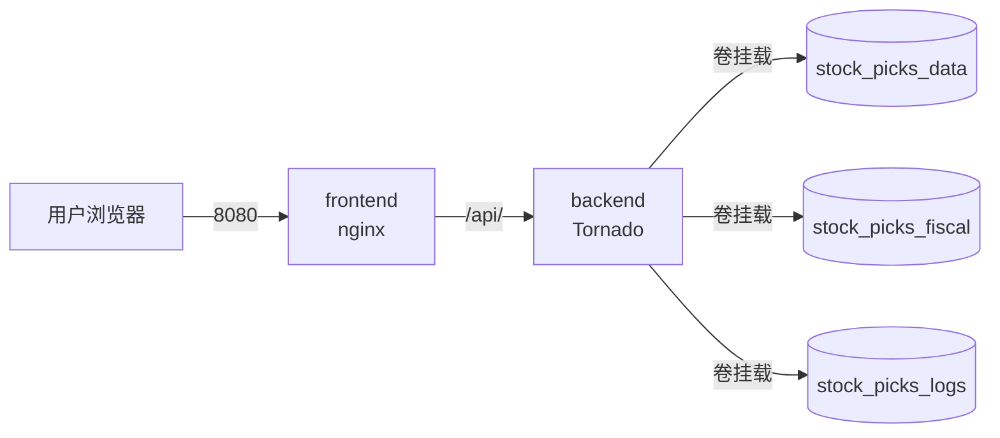

# Docker 部署

使用 Docker Compose 一键启动前后端。

## 前置条件

- **Docker Desktop** (Windows / macOS)
- **Docker Engine + docker-compose** (Linux)

```bash
docker --version
docker-compose --version
```

## 一键启动

```bash
# 1. 克隆项目
git clone https://github.com/your-username/stock-picks-v2.git
cd stock-picks-v2

# 2. 启动 (后台模式)
docker-compose up -d

# 3. 查看状态
docker-compose ps

# 应显示:
#   NAME                    STATUS              PORTS
#   stock-picks-backend     Up (healthy)        0.0.0.0:5001->5001/tcp
#   stock-picks-frontend    Up (healthy)        0.0.0.0:8080->80/tcp

# 4. 访问
# 前端: http://localhost:8080
# 后端: http://localhost:5001/api/health
```

## 架构图



## 常用命令

```bash
# 实时日志
docker-compose logs -f backend

# 重启某个服务
docker-compose restart backend

# 停止并清理 (保留数据卷)
docker-compose down

# 完全清理 (删除数据卷)
docker-compose down -v

# 重新构建镜像
docker-compose build --no-cache

# 进入容器调试
docker-compose exec backend bash
```

## 数据持久化

通过 **named volumes** 持久化数据:

| 卷名 | 用途 | 默认路径 (容器内) |
| --- | --- | --- |
| `stock_picks_data` | 历史 K 线 | `/app/data` |
| `stock_picks_fiscal` | 财务数据 | `/app/data/fiscal` |
| `stock_picks_logs` | 应用日志 | `/app/logs` |

查看卷信息:

```bash
docker volume ls | grep stock_picks
docker volume inspect stock-picks-v2_stock_picks_data
```

### 自定义数据源 (可选)

如需挂载本地目录替代默认卷:

```yaml
# docker-compose.yml 中修改
volumes:
  # 注释掉 named volume
  # - stock_picks_data:/app/data
  # 用 bind mount 指向本地
  - D:/stock-picks/data:/app/data
```

## 环境变量

`docker-compose.yml` 中可配置:

| 变量 | 默认值 | 说明 |
| --- | --- | --- |
| `STOCK_PICKS_DATA` | `/app/data` | 历史数据目录 |
| `STOCK_PICKS_FISCAL` | `/app/data/fiscal` | 财务数据目录 |
| `STOCK_PICKS_LOGS` | `/app/logs` | 日志目录 |
| `API_PORT` | `5001` | 后端端口 |
| `DEBUG_MODE` | `false` | 调试模式 |
| `TZ` | `Asia/Shanghai` | 时区 |

修改后需重建:

```bash
docker-compose down
docker-compose up -d --build
```

## 多端口配置

如 5001 / 8080 已被占用:

```yaml
# docker-compose.yml
services:
  backend:
    ports:
      - "5501:5001"   # 主机:容器
  frontend:
    ports:
      - "8880:80"
```

注意同时修改 `frontend/nginx.conf` 中的 `proxy_pass http://backend:5001;` 仍指向容器内端口。

## 健康检查

```bash
# 后端健康检查
curl http://localhost:5001/api/health

# 前端健康检查 (通过 nginx)
curl http://localhost:8080/healthz
```

Docker 自动健康检查已配置:

- 后端: 每 30s 一次 `/api/health`
- 前端: 每 30s 一次 `/healthz`

## 性能调优

### 后端多 worker

```yaml
# docker-compose.yml
services:
  backend:
    command: gunicorn main:app --bind 0.0.0.0:5001 --workers 4
```

### 前端 nginx 缓存

```nginx
# frontend/nginx.conf
location ~* \.(js|css|png|jpg|svg)$ {
    expires 7d;
    add_header Cache-Control "public";
}
```

## 卸载

```bash
# 停止并删除所有容器、镜像、数据卷
docker-compose down --rmi all -v

# 清理 dangling 资源
docker system prune -a
```

## 故障排查

### 后端启动失败

```bash
# 查看日志
docker-compose logs backend | tail -50

# 常见原因:
# 1. 端口被占用 → 改端口
# 2. 数据卷权限问题 → chmod 777
# 3. Python 包安装失败 → 重建镜像
```

### 前端 502 Bad Gateway

```bash
# 后端没起来 / 健康检查失败
docker-compose ps
docker-compose logs backend

# 临时绕过 nginx 直接访问后端
curl http://localhost:5001/api/health
```