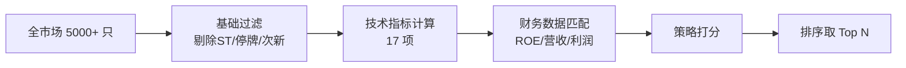

# 选股策略概览

## 4 套策略一览

| 策略 | 适用风格 | 持仓周期 | 核心指标 | 筛选样本量 |
| --- | --- | --- | --- | --- |
| **短线激进** | 短线交易者 | 1-5 天 | KDJ 金叉、量比、换手率 | ~300 只 |
| **中长线稳健** | 价值投资者 | 1-6 个月 | MA 趋势、MACD、ROE | ~150 只 |
| **综合均衡** | 大众投资者 | 1-3 个月 | 5 维评分综合 | ~200 只 |
| **RSRS 阻力支撑** | 技术派 | 1-3 周 | RSRS 斜率 + R² | ~100 只 |

## 选股流程图



## 5 维评分模型

`综合均衡` 策略采用 5 维评分:

```
总分 = 技术面(40%) + 基本面(30%) + 资金面(15%) + 估值面(10%) + 市场面(5%)
```

各维度满分 100 分，加权后满分 100。

### 维度权重可调

通过 `config.py` 中 `STRATEGY_WEIGHTS` 修改:

```python
STRATEGY_WEIGHTS = {
    "technical": 0.40,
    "fundamental": 0.30,
    "capital": 0.15,
    "valuation": 0.10,
    "market": 0.05,
}
```

## 策略适用场景对照

| 你的风格 | 推荐策略 | 调仓频率 |
| --- | --- | --- |
| 上班族看盘少 | 中长线稳健 | 周/月度 |
| 每日盯盘 | 短线激进 | 日度 |
| 想均衡 | 综合均衡 | 周度 |
| 技术派 | RSRS 阻力支撑 | 日/周度 |

## 详细策略说明

- 📈 [短线策略](short-term.md) — KDJ 金叉 + 量比 + 换手率
- 📊 [中长线策略](mid-long-term.md) — MA 趋势 + MACD + ROE
- 🎯 [综合策略](comprehensive.md) — 5 维评分综合
- 📉 [RSRS 阻力支撑](../indicators/rsrs.md) — 阻力支撑相对位置

## 实际调用示例

```python
from selector import StockSelector

selector = StockSelector()

# 短线
short_picks = selector.run_short_term_strategy(top_n=20)

# 中长线
mid_long_picks = selector.run_mid_long_term_strategy(top_n=20)

# 综合
comprehensive_picks = selector.run_comprehensive_strategy(top_n=20)

# RSRS
rsrs_picks = selector.run_rsrs_strategy(top_n=20)
```

每条结果包含:

```python
{
    "code": "600519",        # 股票代码
    "name": "贵州茅台",
    "score": 85.6,           # 总分 (0-100)
    "indicators": {...},     # 17 项指标明细
    "financial": {...},      # 财务数据
    "reasons": [...],        # 推荐理由 (可解释性)
}
```